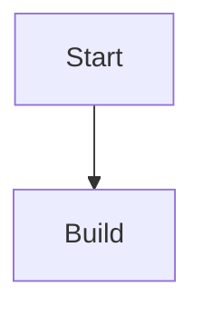

# Subject: Code and Technical Content

Includes code blocks, diagrams, and math.

## Use this when

- showing commands or source code
- adding architecture or flow diagrams
- writing equations or math-heavy technical docs

## Minimum working patterns

### Code block

````markdown
```bash
zensical build
```
````

### Mermaid diagram

````markdown

````

### Math

```markdown
Inline: $E=mc^2$

Block:
$$
\int_0^1 x^2 dx
$$
```

## Required config / prerequisites

- syntax highlighting and advanced code features depend on markdown extensions
- diagrams require Mermaid support
- math rendering requires configured math engine (MathJax/KaTeX path)
- use [Configuration Reference](../dependencies/configuration-reference.md) when the user needs actual TOML, `extra_javascript`, or `extra_css` examples

Use [Extension Prerequisites](../dependencies/extension-prereqs.md) for prerequisite mapping.

## Common options the model may need

- code title/line number/highlight options
- diagram type selection by intent (flow, sequence, state)
- inline vs block math choice

## Common mistakes to avoid

- malformed fence syntax or missing language labels
- using advanced code options without checking support
- combining unsupported Mermaid constructs blindly
- adding math delimiters incompatible with configured renderer

## Interactions / caveats

- client-side navigation may require runtime-safe behavior for diagrams/math rendering.
- if runtime behavior is uncertain, check [Navigation and Runtime Caveats](../dependencies/navigation-runtime-caveats.md).

## Deeper docs

- [Code blocks](https://zensical.org/docs/authoring/code-blocks/)
- [Diagrams](https://zensical.org/docs/authoring/diagrams/)
- [Math](https://zensical.org/docs/authoring/math/)
